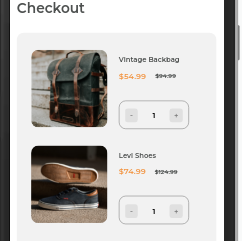
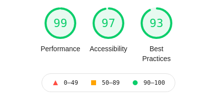
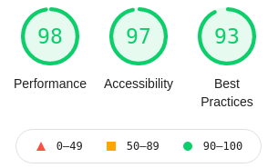

<!-- Please update value in the {}  -->

<h1 align="center">Checkout Page</h1>

   Solution for a challenge from  <a href="http://devchallenges.io" target="_blank">Devchallenges.io</a>.

  <h3>
    <a href="https://docheckout.surge.sh">
      Demo
    </a>
     | 
    <a href="https://github.com/HIIfeanyichukwu/checkout-page">
      Solution
    </a>
     | 
    <a href="https://devchallenges.io/challenges/0J1NxxGhOUYVqihwegfO">
      Challenge
    </a>
  </h3>

<!-- TABLE OF CONTENTS -->

## Table of Contents

- [Overview](#overview)
  - [Built With](#built-with)
- [Features](#features)
- [Contact](#contact)
- [Acknowledgements](#acknowledgements)

<!-- OVERVIEW -->

## Overview

Introduce your projects by taking a screenshot or a gif. Try to tell visitors a story about your project by answering:

- Where can I see your demo?
  - [demo](https://dochekout.surge.sh)
- What was your experience?
  - very basic
- What have you learned/improved?
  - I've learnt how to make forms accessible for all people
  - I've learnt how to enable users fill required fields by giving signals when a required field is not filled, also by showing clearly which fields are optional
  - I've learned how to make the forms look good using css.
- Your wisdom? :)
  - even on slow days keep moving forward!

##### Below are the results of my testing with light house from Chrome browser

For desktop

For mobile

### Built With

<!-- This section should list any major frameworks that you built your project using. Here are a few examples.-->

- HTML
- CSS
- JAVASCRIPT

## Features

This application/site was created as a submission to a [DevChallenges](https://devchallenges.io/challenges) challenge. The [challenge](https://devchallenges.io/challenges/0J1NxxGhOUYVqihwegfO) was to build an application to complete the given user stories.

The targetted screen sizes are 375px and 1440px

## Acknowledgements

- [Steps to replicate a design with only HTML and CSS](https://devchallenges-blogs.web.app/how-to-replicate-design/)
- [Node.js](https://nodejs.org/)
- [Marked - a markdown parser](https://github.com/chjj/marked)
- [Forms](https://web.dev/learn/forms/)

## Contact

- GitHub [@DoIfeanyichukwu](https://{github.com/your-usermame})
- Twitter [@DoIfeanyichukwu](https://twitter.com/HIIfeanyichukwu)

***
please anticipate my writeup on why beginners should learn to include accessibility at the early stages of learning
